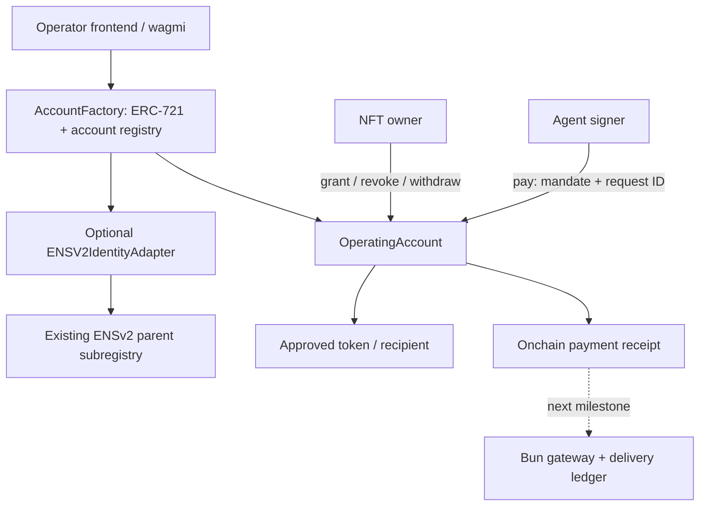

# Architecture decision record — initial operating account

## Product boundary

A company configures financial authority once. An agent proposes a structured payment. The account enforces the authority, while the gateway records the payment and the offchain service outcome separately.

## Ownership

`ownerOf(tokenId)` is the root authority for that account. Each factory-created account has a stable address and an initial ownership epoch of 1. Handover is two-step: the current owner proposes a recipient; the recipient accepts. Acceptance increments the epoch before its receiver callback. Existing grants are invalid thereafter, even if the NFT later returns to the original owner.

NFT operator approvals and standard transfer entry points revert. This deliberately sacrifices generic marketplace transfer compatibility. ERC-721 ownership representation is useful without claiming unrestricted NFT tradability. Factory-owned accounts cannot own other accounts from the same factory; external contract-owner cycles remain an integration concern.

## Payment authority

Each mandate fixes one signer, token and recipient, with a per-payment maximum, total budget and absolute expiry. Multiple providers require multiple grants. Grants are account-local and therefore chain-local. There is no arbitrary call or token approval path. The owner can withdraw and revoke at any time; agent authority is subordinate, not a financial commitment by the owner.

Payments consume budget and reserve the business request ID before token interaction, under a reentrancy guard. Reverted token transfers roll both changes back. Request IDs cannot be reused across grants on the same account. A compromised agent can invent new IDs and spend up to its budget; replay protection does not establish invoice legitimacy. The next gateway must derive stable IDs from authenticated business records.

Expiry fails at `block.timestamp >= expiry`. Revocation affects execution after the revocation is included in chain state; it cannot undo a payment or outrank a transaction ordered before it.

## Evidence and delivery

Only successful payments emit payment events. Reverted transactions cannot retain their logs. Denied attempts must be recorded by the gateway with the error and simulation/transaction evidence, clearly distinguished from onchain success events.

The target operation states are: requested, authorization_required, submitted, payment_confirmed, delivery_pending, delivered, delivery_failed. A service failure after payment cannot automatically trigger another payment. Receipts bind account, mandate, request, token, recipient and amount. Service completion is separate evidence, not implied by settlement.

The frontend playground is explicitly a local simulation, not a security boundary. Contract workspace uses generated ABIs and real wallet transactions.

## ENS and chains

On Sepolia, a factory may register its account subname atomically through the adapter. If registration fails, account creation reverts. The ENS subname is held by the adapter, with no name-level owner roles, and resolves to the stable account address. The ERC-721 holder does not independently receive a tradable ENS token. Parent registry administrators may retain rights; parent expiry and authority must be disclosed.

An Arc factory cannot synchronously call Sepolia ENS. A cross-chain identity flow requires a separately specified authenticated process and pending/confirmed state; no unchecked relay is implemented. Keep the same-chain identity proof and Arc execution milestone separate until that trust model is selected.

## Subsequent modular-account work

Preserve factory lookup, mandate semantics and receipt schema while adapting an established ERC-7579 account. Every entry point, alternate validator and installed executor must preserve policy. Do not assume an immutable owner validator excludes other spending paths. ERC-4337 bundler/paymaster support is an implementation milestone, not a property of this prototype.
